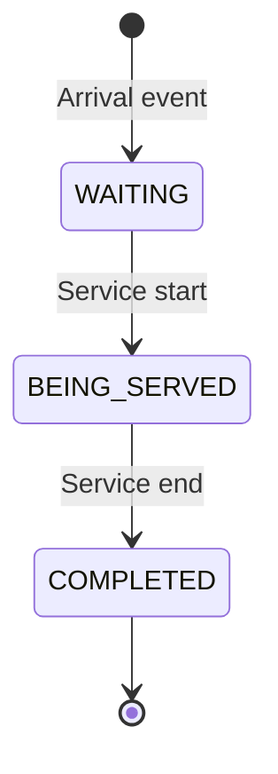
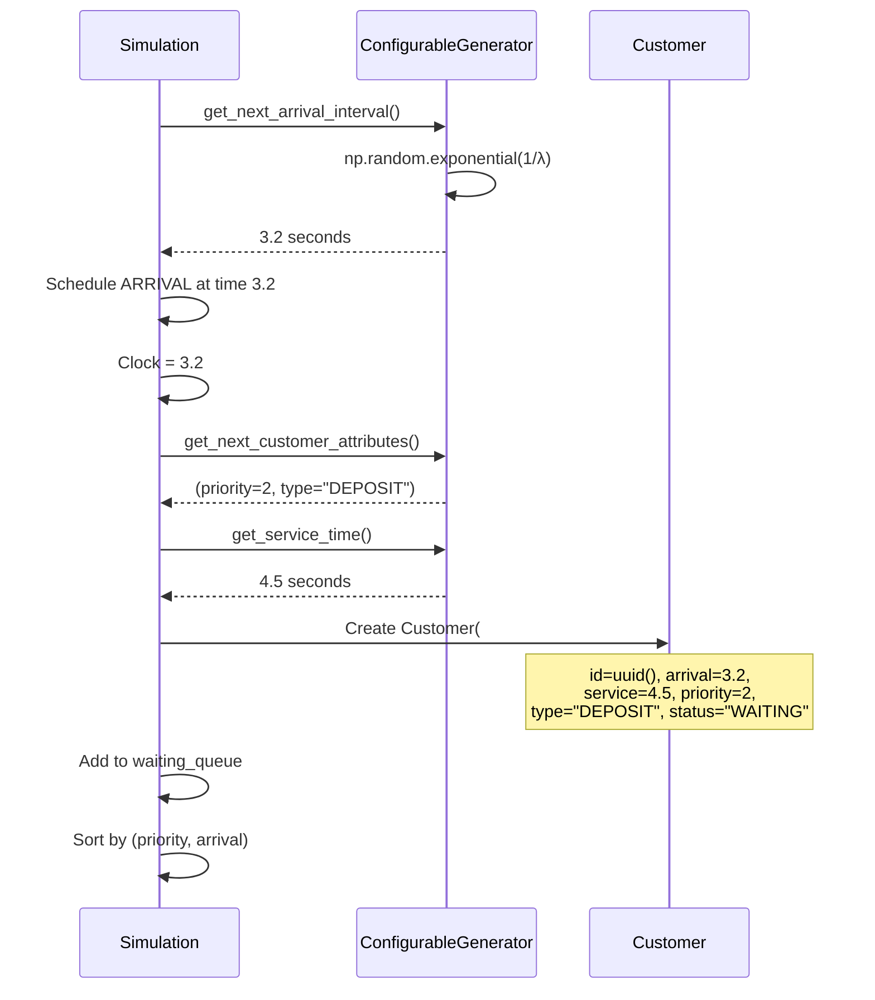

## Module Overview

The Customer module (`backend/src/customer/`) manages:

- Customer entity definition
- Customer attribute generation
- Poisson arrival process
- Priority and transaction type assignment

## Directory Structure

```
customer/
├── domain/
│   ├── customer.py          # Customer entity
│   ├── priority.py          # Priority enum
│   ├── transaction_type.py  # Transaction types
│   ├── arrival_time.py      # Arrival utilities
│   ├── service_time.py      # Service time utilities
│   └── ports/
│       └── customer_generator.py  # Port interface
├── application/
│   └── generate_customer.py   # Use case
└── infrastructure/
    └── poisson_customer_generator.py  # Adapter
```

## Customer Entity

Defined in `customer/domain/customer.py`:

```python
from dataclasses import dataclass
from typing import Optional

@dataclass
class Customer:
    id: str
    arrival_time: float
    service_time: float
    priority: int
    transaction_type: str
    status: str = "WAITING"
    service_start_time: Optional[float] = None
```

### Attributes

| Field | Type | Description |
|-------|------|-------------|
| `id` | `str` | Unique identifier (8-char UUID) |
| `arrival_time` | `float` | Simulation time when customer arrives |
| `service_time` | `float` | Duration required at teller |
| `priority` | `int` | 1 (High), 2 (Medium), or 3 (Low) |
| `transaction_type` | `str` | DEPOSIT, WITHDRAWAL, TRANSFER, INQUIRY |
| `status` | `str` | WAITING, BEING_SERVED, or COMPLETED |
| `service_start_time` | `Optional[float]` | Time when service began |

### Lifecycle



### Calculated Metrics

```python
# Wait time in queue
wait_time = customer.service_start_time - customer.arrival_time

# Total time in system
total_time = completion_time - customer.arrival_time
```

## Priority Enum

```python
from enum import Enum

class Priority(Enum):
    HIGH = 1
    MEDIUM = 2
    LOW = 3
```

**Ordering**: Customers are served by priority (1 first, 3 last), with ties broken by arrival time.

## Transaction Types

```python
class TransactionType(Enum):
    DEPOSIT = "DEPOSIT"
    WITHDRAWAL = "WITHDRAWAL"
    TRANSFER = "TRANSFER"
    INQUIRY = "INQUIRY"
```

Different transaction types can have different service time distributions.

## CustomerGenerator Port

**Interface** defined in `customer/domain/ports/customer_generator.py`:

```python
from abc import ABC, abstractmethod
from typing import Tuple

class CustomerGenerator(ABC):
    @abstractmethod
    def get_next_arrival_interval(self) -> float:
        """Time until next customer arrives."""
        pass
    
    @abstractmethod
    def get_next_customer_attributes(self) -> Tuple[int, str]:
        """Returns (priority, transaction_type)."""
        pass
    
    @abstractmethod
    def get_service_time(self) -> float:
        """Duration of service for this customer."""
        pass
```

<Note>
This is a **port** (interface). The simulation depends on this abstraction, not on concrete implementations.
</Note>

## ConfigurableGenerator (Adapter)

**Implementation** in `customer/infrastructure/poisson_customer_generator.py`:

```python
import numpy as np
import random

class ConfigurableGenerator:
    def __init__(self, config: dict):
        self.arrival_rate = config.get("arrival_rate", 1.0)
        self.arrival_dist = config.get("arrival_dist", "exponential")
        self.priority_weights = config.get("priority_weights", [0.1, 0.3, 0.6])
        self.service_mean = config.get("service_mean", 5.0)
        self.service_dist = config.get("service_dist", "exponential")
        self.service_stddev = config.get("service_stddev", 1.0)
```

### Arrival Interval Generation

**Exponential distribution** (default):

```python
def get_next_arrival_interval(self) -> float:
    if self.arrival_dist == "exponential":
        return np.random.exponential(1.0 / self.arrival_rate)
    else:
        raise ValueError(f"Unknown arrival distribution: {self.arrival_dist}")
```

**Mathematics**:
- Inter-arrival time ~ Exp(λ) where λ = `arrival_rate`
- Mean inter-arrival time = 1/λ
- Example: λ=1.0 ⇒ average 1 customer per time unit

### Priority Assignment

Using **weighted random choice**:

```python
def get_next_customer_attributes(self) -> Tuple[int, str]:
    # Select priority based on weights
    priority = random.choices(
        [1, 2, 3],
        weights=self.priority_weights
    )[0]
    
    # Select transaction type uniformly
    transaction_type = random.choice([
        "DEPOSIT", "WITHDRAWAL", "TRANSFER", "INQUIRY"
    ])
    
    return priority, transaction_type
```

**Example**:
- `priority_weights = [0.1, 0.3, 0.6]`
- 10% High priority
- 30% Medium priority
- 60% Low priority

### Service Time Generation

**Exponential distribution** (default):

```python
def get_service_time(self) -> float:
    if self.service_dist == "exponential":
        return np.random.exponential(self.service_mean)
    elif self.service_dist == "normal":
        return max(0.1, np.random.normal(self.service_mean, self.service_stddev))
    else:
        return self.service_mean
```

**Options**:
- `exponential`: Memoryless, models random service
- `normal`: Fixed mean with variance
- `constant`: Always `service_mean`

<Tip>
Exponential service times are common in queueing theory and represent highly variable service.
</Tip>

## Customer Creation Flow



## Configuration Example

```python
config = {
    # Arrivals
    "arrival_rate": 1.5,        # 1.5 customers per minute
    "arrival_dist": "exponential",
    "priority_weights": [0.2, 0.3, 0.5],  # 20% high, 30% med, 50% low
    
    # Service
    "service_mean": 3.0,        # Average 3 minutes per customer
    "service_dist": "exponential",
    "service_stddev": 1.0       # Used if dist="normal"
}

generator = ConfigurableGenerator(config)
```

## Stochastic Modeling

### Arrival Process (Poisson)

**Properties**:
- Arrivals are **independent**
- Inter-arrival times are **exponentially distributed**
- Number of arrivals in time T follows **Poisson(λT)**

**Formula**:
```
P(k arrivals in time T) = ((λT)^k * e^(-λT)) / k!
```

### Service Time Distribution

**Exponential** (μ = service_mean):
- P(service ≤ t) = 1 - e^(-t/μ)
- Mean = μ
- Variance = μ²
- Memoryless property

**Normal** (μ, σ):
- P(service ≤ t) = Φ((t-μ)/σ)
- Mean = μ
- Variance = σ²
- More realistic for human tasks

## Testing Generators

```python
import numpy as np

def test_arrival_rate():
    config = {"arrival_rate": 2.0}
    gen = ConfigurableGenerator(config)
    
    # Generate 10000 intervals
    intervals = [gen.get_next_arrival_interval() for _ in range(10000)]
    
    # Mean should be ~0.5 (1/arrival_rate)
    assert 0.48 < np.mean(intervals) < 0.52

def test_priority_distribution():
    config = {"priority_weights": [0.1, 0.3, 0.6]}
    gen = ConfigurableGenerator(config)
    
    priorities = [gen.get_next_customer_attributes()[0] for _ in range(10000)]
    
    # Count distribution
    counts = [priorities.count(p) for p in [1, 2, 3]]
    ratios = [c/10000 for c in counts]
    
    # Should match weights
    assert 0.08 < ratios[0] < 0.12  # ~10%
    assert 0.28 < ratios[1] < 0.32  # ~30%
    assert 0.58 < ratios[2] < 0.62  # ~60%
```

## Next Steps

<CardGroup cols={2}>
  <Card title="Queue Module" icon="bars-staggered" href="/architecture/backend/queue-module">
    How customers are ordered in the waiting queue
  </Card>
  <Card title="Simulation Engine" icon="gears" href="/architecture/backend/simulation-engine">
    How customer arrivals trigger events
  </Card>
  <Card title="Poisson Arrivals" icon="clock" href="/concepts/poisson-arrivals">
    Mathematical foundation of arrival modeling
  </Card>
  <Card title="Priority Queuing" icon="sort" href="/concepts/priority-queuing">
    How priorities affect service order
  </Card>
</CardGroup>
