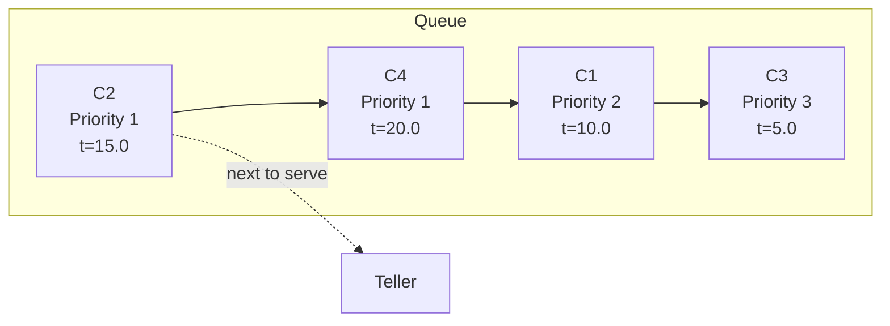

## Overview

The Queue module manages the waiting line of customers using a priority-based ordering system. Located at `backend/src/queue/`, it ensures customers are served in the correct order based on priority and arrival time.

## Current Implementation

SimulationBank uses a **list-based priority queue** with sorting:

```python
# In DiscreteEventSimulation
self.waiting_queue: List[Customer] = []

# Adding a customer
self.waiting_queue.append(customer)
self.waiting_queue.sort(key=lambda c: (c.priority, c.arrival_time))

# Removing a customer
next_customer = self.waiting_queue.pop(0)
```

### Ordering Key

```python
key = (customer.priority, customer.arrival_time)
```

**Lexicographic ordering**:
1. **Primary**: Priority (1 before 2 before 3)
2. **Secondary**: Arrival time (earlier before later)

This implements **priority scheduling with FIFO tie-breaking**.

## Priority Levels

```python
class Priority(Enum):
    HIGH = 1
    MEDIUM = 2
    LOW = 3
```

### Service Order Example

| Customer | Priority | Arrival Time | Position |
|----------|----------|--------------|----------|
| C1 | 2 (Medium) | 10.0 | 3 |
| C2 | 1 (High) | 15.0 | 1 |
| C3 | 3 (Low) | 5.0 | 4 |
| C4 | 1 (High) | 20.0 | 2 |

**Sorted order**: C2 (1, 15.0), C4 (1, 20.0), C1 (2, 10.0), C3 (3, 5.0)

<Note>
C2 is served before C4 even though C4 arrived earlier, because C2 also has high priority and arrived first among high-priority customers.
</Note>

## Operations

### Enqueue

```python
def enqueue(customer: Customer):
    waiting_queue.append(customer)
    waiting_queue.sort(key=lambda c: (c.priority, c.arrival_time))
```

**Time Complexity**: O(n log n) due to sorting

### Dequeue

```python
def dequeue() -> Customer:
    if not waiting_queue:
        raise Exception("Queue is empty")
    return waiting_queue.pop(0)
```

**Time Complexity**: O(n) due to list shift

### Peek

```python
def peek() -> Optional[Customer]:
    return waiting_queue[0] if waiting_queue else None
```

**Time Complexity**: O(1)

### Size

```python
def size() -> int:
    return len(waiting_queue)
```

**Time Complexity**: O(1)

## Visualization



## Alternative: Heap-Based Queue

For better performance with large queues, a min-heap can be used:

```python
import heapq

class PriorityQueue:
    def __init__(self):
        self.heap = []
        self.counter = 0  # Tie-breaker for equal priorities
    
    def enqueue(self, customer: Customer):
        # Priority tuple: (priority, arrival_time, counter, customer)
        entry = (customer.priority, customer.arrival_time, self.counter, customer)
        heapq.heappush(self.heap, entry)
        self.counter += 1
    
    def dequeue(self) -> Customer:
        if not self.heap:
            raise Exception("Queue is empty")
        _, _, _, customer = heapq.heappop(self.heap)
        return customer
    
    def peek(self) -> Optional[Customer]:
        return self.heap[0][3] if self.heap else None
    
    def size(self) -> int:
        return len(self.heap)
```

### Complexity Comparison

| Operation | List + Sort | Heap |
|-----------|-------------|------|
| Enqueue | O(n log n) | O(log n) |
| Dequeue | O(n) | O(log n) |
| Peek | O(1) | O(1) |
| Size | O(1) | O(1) |

<Tip>
For queues with &gt;100 customers, consider switching to the heap-based implementation.
</Tip>

## Capacity Limits

```python
max_queue_capacity = config.max_queue_capacity  # Default: 100

if len(waiting_queue) >= max_queue_capacity:
    # Reject customer
    metrics.record_customer_rejected(customer)
else:
    # Accept customer
    waiting_queue.append(customer)
```

When capacity is reached:
- New arrivals are **rejected**
- Rejection is recorded in metrics
- Customer does not enter the system

## Queue State Snapshot

```python
def get_queue_state() -> List[dict]:
    return [
        {
            "id": c.id,
            "priority": c.priority,
            "arrival_time": c.arrival_time,
            "wait_time": current_clock - c.arrival_time
        }
        for c in waiting_queue
    ]
```

This is used by the API to return current queue status.

## Performance Metrics

### Queue Length

```python
queue_length = len(waiting_queue)
```

Tracked over time to monitor congestion.

### Average Wait Time

```python
avg_wait = sum(clock - c.arrival_time for c in waiting_queue) / len(waiting_queue)
```

Estimates delay for customers currently waiting.

### Priority Distribution

```python
from collections import Counter

priority_counts = Counter(c.priority for c in waiting_queue)
# {1: 5, 2: 12, 3: 20}
```

Shows composition of waiting customers.

## Queue Invariants

1. **Ordering**: Queue is always sorted by (priority, arrival_time)
2. **Capacity**: `len(waiting_queue) <= max_queue_capacity`
3. **No duplicates**: Each customer ID appears at most once
4. **Status consistency**: All customers in queue have status="WAITING"

## Testing

```python
def test_priority_ordering():
    queue = []
    
    # Add customers out of order
    c1 = Customer(id="C1", priority=2, arrival_time=10.0, ...)
    c2 = Customer(id="C2", priority=1, arrival_time=15.0, ...)
    c3 = Customer(id="C3", priority=1, arrival_time=5.0, ...)
    
    queue.extend([c1, c2, c3])
    queue.sort(key=lambda c: (c.priority, c.arrival_time))
    
    # First should be C3 (priority 1, earliest)
    assert queue[0].id == "C3"
    # Second should be C2 (priority 1, later)
    assert queue[1].id == "C2"
    # Third should be C1 (priority 2)
    assert queue[2].id == "C1"
```

## Frontend Visualization

The React frontend displays the queue with color-coded priorities:

```jsx
function QueueVisualizer({ customers }) {
  const getPriorityColor = (priority) => {
    switch(priority) {
      case 1: return 'bg-red-500';    // High
      case 2: return 'bg-yellow-500'; // Medium
      case 3: return 'bg-green-500';  // Low
    }
  };
  
  return (
    <div className="queue">
      {customers.map(customer => (
        <div 
          key={customer.id}
          className={getPriorityColor(customer.priority)}
        >
          {customer.id}
        </div>
      ))}
    </div>
  );
}
```

## Common Patterns

### Starvation Prevention

Without proper controls, low-priority customers can **starve** if high-priority customers keep arriving.

**Mitigation strategies**:
1. **Aging**: Increase priority as wait time grows
2. **Priority caps**: Limit number of high-priority customers
3. **Time limits**: Guarantee service within max wait time

<Warning>
The current implementation does NOT prevent starvation. In high-load scenarios with continuous high-priority arrivals, low-priority customers may wait indefinitely.
</Warning>

### Balking

Customers may **balk** (refuse to join) if the queue is too long:

```python
if len(waiting_queue) > balking_threshold:
    customer.balk()
else:
    waiting_queue.append(customer)
```

Not currently implemented but could be added.

## Related Queueing Theory

### Little's Law

```
L = λ * W
```

Where:
- L = average number in queue
- λ = arrival rate
- W = average wait time

### M/M/c Queue

SimulationBank approximates an **M/M/c/K** queue:
- M: Poisson (Markovian) arrivals
- M: Exponential service times
- c: Number of tellers
- K: Maximum queue capacity

## Next Steps

<CardGroup cols={2}>
  <Card title="Teller Module" icon="building-columns" href="/architecture/backend/teller-module">
    How tellers pull customers from the queue
  </Card>
  <Card title="Priority Queuing Concepts" icon="sort" href="/concepts/priority-queuing">
    Theory behind priority-based service
  </Card>
  <Card title="Simulation Engine" icon="gears" href="/architecture/backend/simulation-engine">
    How the queue integrates with event processing
  </Card>
  <Card title="Metrics Module" icon="chart-line" href="/architecture/backend/metrics-module">
    How queue metrics are tracked
  </Card>
</CardGroup>
