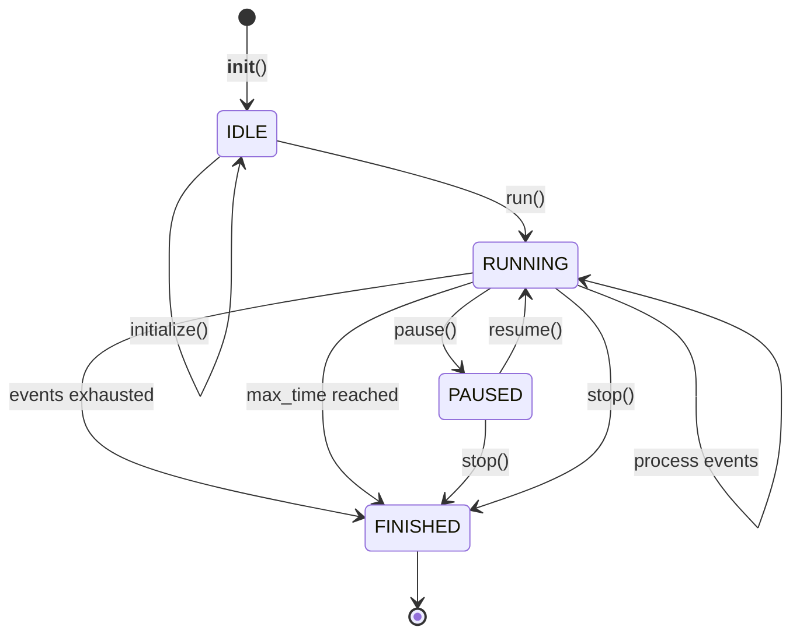

## Overview

The simulation engine is implemented in the `DiscreteEventSimulation` class located at `backend/src/simulation/domain/simulation.py`. It orchestrates all simulation activities using a discrete event simulation (DES) approach.

## Core Components

### Event Queue

Implemented using Python's `heapq` min-heap:

```python
import heapq

self.event_queue: List[SimulationEvent] = []

# Schedule an event
heapq.heappush(self.event_queue, event)

# Get next event
current_event = heapq.heappop(self.event_queue)
```

**Why heapq?**
- O(log n) insertion
- O(log n) extraction of minimum
- Automatically maintains chronological order

### Simulation Clock

```python
self.clock: float = 0.0
```

The clock advances by **jumping** to the time of the next event (not continuous):

```python
self.clock = current_event.time
```

<Note>
This is **discrete** time advancement, not real-time. A simulation of 8 hours might complete in seconds.
</Note>

### System State

```python
self.tellers: Dict[str, Teller] = {}
self.waiting_queue: List[Customer] = []
```

State is modified only during event processing.

## Initialization

The `initialize()` method prepares the simulation:

```python
def initialize(self) -> None:
    self.status = SimulationStatus.IDLE
    self.clock = 0.0
    self.waiting_queue.clear()
    self.event_queue.clear()
    
    # Create tellers
    for i in range(self.config.num_tellers):
        t_id = f"T-{i+1}"
        self.tellers[t_id] = Teller(id=t_id)
    
    # Schedule first arrival
    first_arrival_time = self.generator.get_next_arrival_interval()
    if first_arrival_time <= self.config.max_simulation_time:
        self.schedule_event(
            SimulationEvent(first_arrival_time, EventType.ARRIVAL)
        )
```

**Key Steps**:
1. Reset clock to 0
2. Clear all queues
3. Initialize tellers with IDLE status
4. Schedule the first customer arrival

## Main Simulation Loop

The `run()` method is the heart of the engine:

```python
def run(self) -> None:
    self.status = SimulationStatus.RUNNING
    while self.event_queue and self.status == SimulationStatus.RUNNING:
        # Extract next event
        current_event = heapq.heappop(self.event_queue)
        
        # Check termination
        if current_event.time > self.config.max_simulation_time:
            break
        
        # Advance clock
        self.clock = current_event.time
        
        # Process event
        self.process_next_event(current_event)
    
    self.status = SimulationStatus.FINISHED
```

**Loop Characteristics**:
- Continues while events exist AND status is RUNNING
- Terminates at `max_simulation_time`
- Can be interrupted by setting status to PAUSED or STOPPED

## Event Processing

Event dispatcher routes to appropriate handlers:

```python
def process_next_event(self, event: SimulationEvent) -> None:
    if event.event_type == EventType.ARRIVAL:
        self.handle_arrival()
    elif event.event_type == EventType.SERVICE_START:
        self.handle_service_start(event.teller_id, event.customer)
    elif event.event_type == EventType.SERVICE_END:
        self.handle_service_end(event.teller_id)
```

### ARRIVAL Event

When a customer arrives:

```python
def handle_arrival(self) -> None:
    # 1. Generate customer attributes
    priority, txn_type = self.generator.get_next_customer_attributes()
    service_time = max(0.1, self.generator.get_service_time())
    
    # 2. Create customer entity
    customer = Customer(
        id=str(uuid.uuid4())[:8],
        arrival_time=self.clock,
        service_time=service_time,
        priority=priority,
        transaction_type=txn_type
    )
    
    # 3. Add to queue
    self.waiting_queue.append(customer)
    self.waiting_queue.sort(key=lambda c: (c.priority, c.arrival_time))
    
    # 4. Schedule NEXT arrival
    next_interval = self.generator.get_next_arrival_interval()
    next_time = self.clock + next_interval
    if next_time <= self.config.max_simulation_time:
        self.schedule_event(SimulationEvent(next_time, EventType.ARRIVAL))
    
    # 5. Try to assign to free teller
    self._assign_free_teller()
```

**Key Points**:
- Generates customer stochastically
- Maintains priority queue ordering
- Chains arrivals (each arrival schedules the next)
- Immediately attempts service if tellers available

### SERVICE_START Event

When a customer begins service:

```python
def handle_service_start(self, teller_id: str, customer: Customer) -> None:
    teller = self.tellers.get(teller_id)
    if teller:
        # Update teller state
        teller.start_service(customer, self.clock)
        
        # Schedule service end
        end_time = self.clock + customer.service_time
        self.schedule_event(
            SimulationEvent(end_time, EventType.SERVICE_END, teller_id=teller_id)
        )
```

**Atomicity**: Service start and end scheduling happen together.

### SERVICE_END Event

When service completes:

```python
def handle_service_end(self, teller_id: str) -> None:
    teller = self.tellers.get(teller_id)
    if teller:
        # Complete service
        served_customer = teller.end_service()
        
        # Try to serve next customer
        self._assign_free_teller()
```

**Cascading**: Ending one service may immediately start another.

## Resource Allocation

The `_assign_free_teller()` method implements the allocation policy:

```python
def _assign_free_teller(self) -> None:
    if not self.waiting_queue:
        return
    
    for t_id, teller in self.tellers.items():
        if teller.status == TellerStatus.IDLE:
            # Pop highest priority customer
            next_customer = self.waiting_queue.pop(0)
            
            # Schedule immediate service start
            self.schedule_event(
                SimulationEvent(
                    self.clock,
                    EventType.SERVICE_START,
                    customer=next_customer,
                    teller_id=t_id
                )
            )
            return  # Assign one at a time
```

**Policy**:
1. Check if customers are waiting
2. Find first IDLE teller
3. Remove highest priority customer from queue
4. Schedule SERVICE_START at current time
5. Stop (only one assignment per call)

<Tip>
Calling `_assign_free_teller()` after arrivals and service completions ensures customers are served ASAP.
</Tip>

## Event Timeline Example

```mermaid
gantt
    title Simulation Timeline
    dateFormat  X
    axisFormat %L
    
    section Events
    ARRIVAL (C1)      :0, 5
    SERVICE_START (C1):5, 10
    ARRIVAL (C2)      :8, 13
    SERVICE_END (C1)  :15, 20
    SERVICE_START (C2):20, 25
    SERVICE_END (C2)  :28, 33
```



## Time Complexity

| Operation | Complexity |
|-----------|------------|
| Schedule event | O(log E) where E = events in queue |
| Extract next event | O(log E) |
| Arrival handling | O(Q log Q) where Q = queue size (due to sort) |
| Service start | O(1) |
| Service end | O(1) |
| Assign teller | O(T) where T = number of tellers |

<Warning>
The `waiting_queue.sort()` on every arrival is O(Q log Q). For large queues, consider using a heap-based priority queue.
</Warning>

## Simulation Lifecycle



## Control Methods

### Pause

```python
def pause(self) -> None:
    if self.status == SimulationStatus.RUNNING:
        self.status = SimulationStatus.PAUSED
```

Pausing stops the event loop but preserves state.

### Resume

```python
def resume(self) -> None:
    if self.status == SimulationStatus.PAUSED:
        self.run()
```

### Stop

```python
def stop(self) -> None:
    self.status = SimulationStatus.FINISHED
    self.event_queue.clear()
```

Stopping clears remaining events and finalizes the simulation.

## Performance Considerations

### Memory Usage

- Event queue grows with arrival rate
- Waiting queue bounded by `max_queue_capacity`
- Total memory: O(E + Q + T)

### Execution Speed

- Simulating 8 hours typically takes &lt;1 second
- Dominated by event processing, not real-time delays
- Scalable to thousands of customers

### Optimization Opportunities

1. **Replace list sort with heapq for queue**:
   ```python
   heapq.heappush(self.waiting_queue, (customer.priority, customer.arrival_time, customer))
   ```

2. **Pre-allocate teller array** instead of dict for O(1) lookup

3. **Batch metrics collection** instead of per-customer

## Next Steps

<CardGroup cols={2}>
  <Card title="Customer Module" icon="user" href="/architecture/backend/customer-module">
    How customers are generated and managed
  </Card>
  <Card title="Queue Module" icon="bars-staggered" href="/architecture/backend/queue-module">
    Priority queue implementation details
  </Card>
  <Card title="Teller Module" icon="building-columns" href="/architecture/backend/teller-module">
    Teller state machine and operations
  </Card>
  <Card title="Metrics Module" icon="chart-line" href="/architecture/backend/metrics-module">
    How performance data is collected
  </Card>
</CardGroup>
