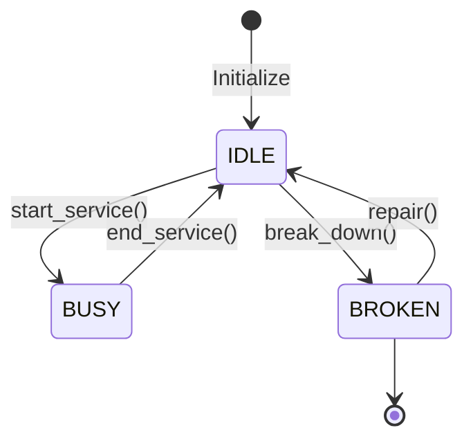
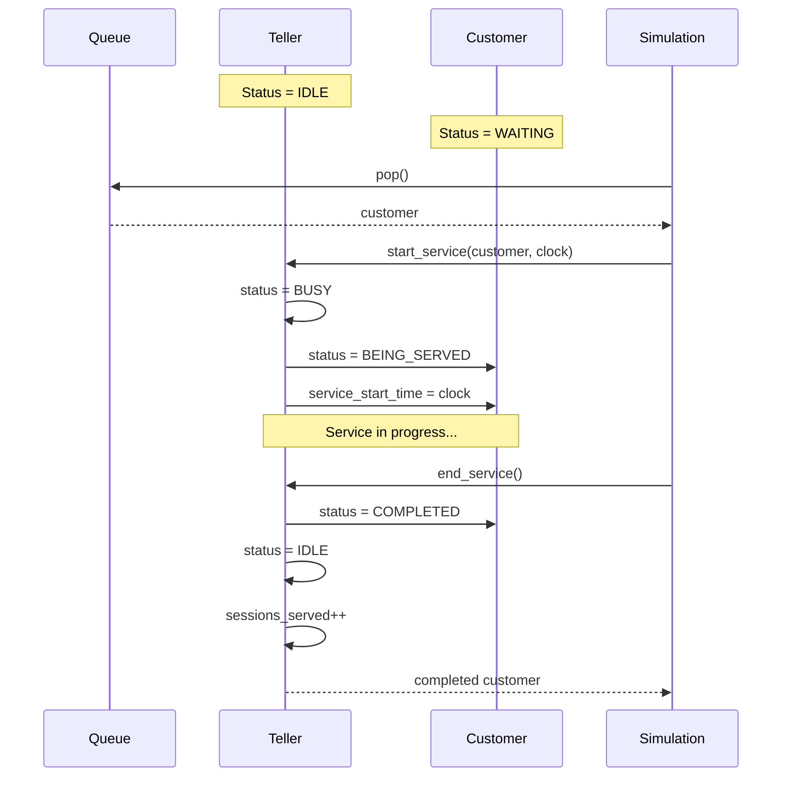

## Overview

The Teller module (`backend/src/teller/`) models bank service windows as resources that serve customers one at a time. It manages teller states, service operations, and utilization tracking.

## Teller Entity

Defined in `teller/domain/teller.py`:

```python
from dataclasses import dataclass
from typing import Optional

@dataclass
class Teller:
    id: str
    status: TellerStatus = TellerStatus.IDLE
    current_customer: Optional[Customer] = None
    sessions_served: int = 0
```

### Attributes

| Field | Type | Description |
|-------|------|-------------|
| `id` | `str` | Unique identifier (e.g., "T-1", "T-2") |
| `status` | `TellerStatus` | Current operational state |
| `current_customer` | `Optional[Customer]` | Customer being served |
| `sessions_served` | `int` | Total customers served |

## TellerStatus Enum

```python
from enum import Enum

class TellerStatus(Enum):
    IDLE = "IDLE"       # Available for service
    BUSY = "BUSY"       # Currently serving
    BROKEN = "BROKEN"   # Out of service (future feature)
```

### State Machine



<Note>
The BROKEN state is defined but not currently used in the simulation. It's reserved for future failure modeling.
</Note>

## Operations

### start_service()

Begins serving a customer:

```python
def start_service(self, customer: Customer, current_time: float) -> None:
    """
    Inicia el proceso de atención para un cliente específico.
    """
    self.status = TellerStatus.BUSY
    self.current_customer = customer
    customer.status = "BEING_SERVED"
    customer.service_start_time = current_time
```

**Side effects**:
1. Teller status → BUSY
2. Customer assigned to teller
3. Customer status → BEING_SERVED
4. Service start time recorded

### end_service()

Completes service and releases the customer:

```python
def end_service(self) -> Optional[Customer]:
    """
    Finaliza el servicio del cliente que está siendo atendido.
    """
    if not self.current_customer:
        return None
    
    served = self.current_customer
    served.status = "COMPLETED"
    self.current_customer = None
    self.status = TellerStatus.IDLE
    self.sessions_served += 1
    return served
```

**Side effects**:
1. Customer status → COMPLETED
2. Teller status → IDLE
3. Teller.current_customer → None
4. sessions_served += 1
5. Returns the served customer

## Initialization

Tellers are created during simulation setup:

```python
# In DiscreteEventSimulation.initialize()
for i in range(self.config.num_tellers):
    t_id = f"T-{i+1}"
    self.tellers[t_id] = Teller(id=t_id)
```

**Example**: For `num_tellers=3`, creates:
- Teller(id="T-1", status=IDLE, ...)
- Teller(id="T-2", status=IDLE, ...)
- Teller(id="T-3", status=IDLE, ...)

## Resource Allocation

The simulation allocates tellers to customers using `_assign_free_teller()`:

```python
def _assign_free_teller(self) -> None:
    if not self.waiting_queue:
        return
    
    for t_id, teller in self.tellers.items():
        if teller.status == TellerStatus.IDLE:
            next_customer = self.waiting_queue.pop(0)
            self.schedule_event(
                SimulationEvent(
                    self.clock,
                    EventType.SERVICE_START,
                    customer=next_customer,
                    teller_id=t_id
                )
            )
            return  # Assign one at a time
```

**Policy**: First available IDLE teller serves the highest priority waiting customer.

## Service Flow



## Utilization Metrics

### Individual Teller Utilization

```python
utilization = busy_time / total_time
```

**Example**:
- Simulation runs for 8 hours (28,800 seconds)
- Teller T-1 is BUSY for 7 hours (25,200 seconds)
- Utilization = 25,200 / 28,800 = 87.5%

### System Utilization

```python
system_utilization = sum(teller.busy_time for teller in tellers) / (num_tellers * total_time)
```

**Example**:
- 3 tellers, 8-hour shift
- Total capacity: 3 × 8 = 24 teller-hours
- Total busy time: 20 teller-hours
- System utilization: 20/24 = 83.3%

### Sessions Served

```python
total_served = sum(teller.sessions_served for teller in tellers.values())
```

Tracks throughput per teller.

## Teller State Snapshot

```python
def get_tellers_state() -> List[dict]:
    return [
        {
            "id": t.id,
            "status": t.status.value,
            "current_customer": t.current_customer.id if t.current_customer else None,
            "sessions_served": t.sessions_served
        }
        for t in tellers.values()
    ]
```

Returned by `/api/tellers/state` endpoint.

## Performance Analysis

### Idle Time

Teller is idle when no customers are waiting:

```python
idle_time = total_time - busy_time
idle_percentage = (idle_time / total_time) * 100
```

**High idle time** (>50%) suggests **over-capacity**.

### Busy Time

Teller is busy while serving customers:

```python
busy_time = sum(customer.service_time for customer in served_customers)
```

**High busy time** (>90%) suggests **under-capacity**.

### Balancing

Ideal utilization: **70-85%**

- &lt;70%: Tellers underutilized, excess capacity
- 70-85%: Optimal balance
- &gt;85%: Risk of long queues and delays

<Tip>
Use the utilization metric to determine optimal `num_tellers` configuration.
</Tip>

## Multi-Teller Scenarios

### Example: 3 Tellers

| Time | T-1 | T-2 | T-3 | Queue |
|------|-----|-----|-----|-------|
| 0 | IDLE | IDLE | IDLE | [] |
| 5 | BUSY (C1) | IDLE | IDLE | [] |
| 8 | BUSY (C1) | BUSY (C2) | IDLE | [] |
| 10 | BUSY (C1) | BUSY (C2) | BUSY (C3) | [] |
| 12 | IDLE | BUSY (C2) | BUSY (C3) | [C4] |
| 13 | BUSY (C4) | BUSY (C2) | BUSY (C3) | [] |

### Load Balancing

Tellers are assigned using **first-available** policy:

```python
for t_id, teller in tellers.items():
    if teller.status == TellerStatus.IDLE:
        # Assign to this teller
        break
```

This naturally balances load across tellers over time.

## Future Extensions

### Teller Breaks

```python
class Teller:
    break_start_time: Optional[float] = None
    break_duration: float = 900  # 15 minutes
    
    def take_break(self, current_time: float):
        if self.status == TellerStatus.IDLE:
            self.status = TellerStatus.BROKEN
            self.break_start_time = current_time
```

### Teller Specialization

```python
class Teller:
    specialties: List[str] = field(default_factory=list)
    
    def can_serve(self, customer: Customer) -> bool:
        return customer.transaction_type in self.specialties
```

### Variable Service Rates

```python
class Teller:
    skill_level: float = 1.0  # Multiplier on service time
    
    def get_service_time(self, base_time: float) -> float:
        return base_time / self.skill_level
```

## Testing

```python
def test_teller_lifecycle():
    teller = Teller(id="T-1")
    customer = Customer(id="C1", arrival_time=10.0, ...)
    
    # Initially idle
    assert teller.status == TellerStatus.IDLE
    assert teller.current_customer is None
    assert teller.sessions_served == 0
    
    # Start service
    teller.start_service(customer, 10.0)
    assert teller.status == TellerStatus.BUSY
    assert teller.current_customer == customer
    assert customer.status == "BEING_SERVED"
    assert customer.service_start_time == 10.0
    
    # End service
    served = teller.end_service()
    assert teller.status == TellerStatus.IDLE
    assert teller.current_customer is None
    assert teller.sessions_served == 1
    assert served == customer
    assert customer.status == "COMPLETED"
```

## Next Steps

<CardGroup cols={2}>
  <Card title="Simulation Engine" icon="gears" href="/architecture/backend/simulation-engine">
    How tellers integrate with event processing
  </Card>
  <Card title="Queue Module" icon="bars-staggered" href="/architecture/backend/queue-module">
    How customers are assigned to tellers
  </Card>
  <Card title="Resource Management" icon="server" href="/concepts/resource-management">
    Theory of resource allocation in queuing systems
  </Card>
  <Card title="Metrics Module" icon="chart-line" href="/architecture/backend/metrics-module">
    How teller performance is measured
  </Card>
</CardGroup>
