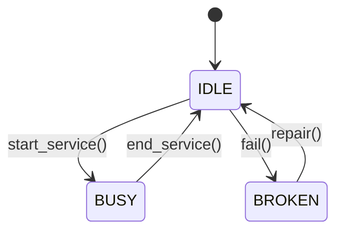
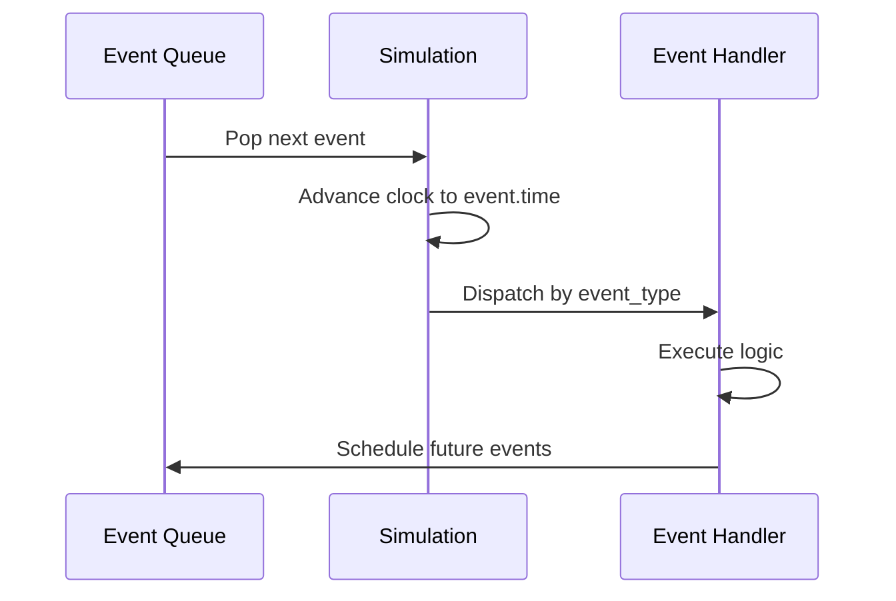

## Domain-Driven Design

SimulationBank's domain model follows DDD principles with clearly defined:

- **Entities**: Objects with unique identity
- **Value Objects**: Immutable objects defined by their attributes
- **Aggregates**: Clusters of entities and value objects
- **Domain Events**: Significant occurrences in the domain

## Core Entities

### DiscreteEventSimulation

**Aggregate Root** - The central entity coordinating the entire simulation.

```python
class DiscreteEventSimulation:
    simulation_id: str
    config: SimulationConfig
    status: SimulationStatus
    clock: float
    tellers: Dict[str, Teller]
    waiting_queue: List[Customer]
    event_queue: List[SimulationEvent]
    generator: CustomerGenerator
```

**Responsibilities**:
- Advance simulation clock
- Process events in chronological order
- Allocate tellers to customers
- Maintain system state

**Invariants**:
- Clock never moves backward
- Events processed in order
- Queue size ≤ max_queue_capacity
- Number of tellers remains constant during simulation

### Customer

**Entity** - Represents a bank customer with unique identity.

```python
@dataclass
class Customer:
    id: str
    arrival_time: float
    service_time: float
    priority: int
    transaction_type: str
    status: str = "WAITING"
    service_start_time: Optional[float] = None
```

**Lifecycle States**:
1. `WAITING` - In queue
2. `BEING_SERVED` - At teller window
3. `COMPLETED` - Service finished

**Derived Properties**:
```python
wait_time = service_start_time - arrival_time
total_time = completion_time - arrival_time
```

### Teller

**Entity** - Represents a service window/resource.

```python
@dataclass
class Teller:
    id: str
    status: TellerStatus = TellerStatus.IDLE
    current_customer: Optional[Customer] = None
    sessions_served: int = 0
```

**State Transitions**:


**Operations**:
- `start_service(customer, current_time)` - Begin serving
- `end_service()` - Complete service, return to IDLE

## Value Objects

### SimulationConfig

**Immutable configuration** for simulation parameters.

```python
@dataclass
class SimulationConfig:
    num_tellers: int = 3
    arrival_config: Dict[str, Any] = field(default_factory=lambda: {
        "arrival_rate": 1.0,
        "arrival_dist": "exponential",
        "priority_weights": [0.1, 0.3, 0.6]
    })
    service_config: Dict[str, Any] = field(default_factory=lambda: {
        "service_mean": 5.0,
        "service_dist": "exponential",
        "service_stddev": 1.0
    })
    max_simulation_time: float = 8.0 * 3600
    max_queue_capacity: int = 100
```

<Note>
Value objects are immutable. Changes require creating a new instance.
</Note>

### Priority

Enum representing customer priority levels.

```python
class Priority(Enum):
    HIGH = 1
    MEDIUM = 2
    LOW = 3
```

**Ordering**: Lower numeric value = higher priority

### TransactionType

Enum for types of banking transactions.

```python
class TransactionType(Enum):
    DEPOSIT = "DEPOSIT"
    WITHDRAWAL = "WITHDRAWAL"
    TRANSFER = "TRANSFER"
    INQUIRY = "INQUIRY"
```

### TellerStatus

Enum for teller operational states.

```python
class TellerStatus(Enum):
    IDLE = "IDLE"
    BUSY = "BUSY"
    BROKEN = "BROKEN"
```

### SimulationStatus

Enum for simulation lifecycle states.

```python
class SimulationStatus(Enum):
    IDLE = "IDLE"
    RUNNING = "RUNNING"
    PAUSED = "PAUSED"
    FINISHED = "FINISHED"
```

## Domain Events

### SimulationEvent

**Value Object** representing significant occurrences.

```python
@dataclass(frozen=True)
class SimulationEvent:
    time: float
    event_type: EventType
    customer: Optional[Customer] = None
    teller_id: Optional[str] = None
    
    def __lt__(self, other):
        return self.time < other.time
```

### EventType

Enum of possible event types.

```python
class EventType(Enum):
    ARRIVAL = "ARRIVAL"
    SERVICE_START = "SERVICE_START"
    SERVICE_END = "SERVICE_END"
```

**Event Processing**:



## Aggregates

### Simulation Aggregate

**Root**: `DiscreteEventSimulation`

**Members**:
- Collection of `Teller` entities
- Collection of `Customer` entities (in queue)
- `SimulationConfig` value object
- Collection of `SimulationEvent` value objects

**Boundary**: All modifications to tellers, customers, and events must go through the simulation root.

```python
# Correct - through aggregate root
simulation.handle_arrival()  # Creates customer, adds to queue

# Incorrect - bypassing aggregate
simulation.waiting_queue.append(customer)  # Breaks invariants
```

## Domain Services

### CustomerGenerator

**Port** (interface) defined in domain layer.

```python
from abc import ABC, abstractmethod

class CustomerGenerator(ABC):
    @abstractmethod
    def get_next_arrival_interval(self) -> float:
        pass
    
    @abstractmethod
    def get_next_customer_attributes(self) -> Tuple[int, str]:
        pass
    
    @abstractmethod
    def get_service_time(self) -> float:
        pass
```

**Implementation**: `ConfigurableGenerator` in infrastructure layer.

### MetricsRepository

**Port** for persisting metrics.

```python
class MetricsRepository(ABC):
    @abstractmethod
    def record_customer_served(self, customer: Customer, clock: float) -> None:
        pass
    
    @abstractmethod
    def get_simulation_report(self) -> SimulationMetrics:
        pass
```

**Implementation**: `InMemoryMetricsRepository` in infrastructure layer.

## Ubiquitous Language

Key domain terms used consistently:

| Term | Definition |
|------|------------|
| **Simulation** | A discrete event model of bank operations |
| **Clock** | Simulated time (not real-time) |
| **Event** | A scheduled occurrence at a specific time |
| **Arrival** | Customer entering the bank |
| **Queue** | Waiting customers ordered by priority |
| **Teller** | Service window/resource |
| **Service** | Time spent at teller window |
| **Priority** | Customer service order (High/Medium/Low) |
| **Utilization** | Percentage of time teller is busy |
| **Throughput** | Customers served per time unit |
| **Wait Time** | Time from arrival to service start |

## Invariants and Business Rules

### Queue Invariants

- Customers ordered by priority (ascending)
- Within same priority, ordered by arrival time (FIFO)
- Queue size never exceeds `max_queue_capacity`

### Teller Invariants

- Teller can serve at most one customer at a time
- `current_customer` is None if and only if status is IDLE
- `sessions_served` is monotonically increasing

### Simulation Invariants

- Clock is monotonically increasing
- Event queue ordered by time
- Simulation stops when clock ≥ `max_simulation_time`

### Business Rules

1. **Priority Service**: Higher priority customers (priority=1) are served before lower priority (priority=3)
2. **FIFO Within Priority**: Among same priority, first arrival is served first
3. **Resource Allocation**: Idle tellers immediately serve waiting customers
4. **Capacity Limits**: Customers rejected if queue is at maximum capacity

## Next Steps

<CardGroup cols={2}>
  <Card title="Simulation Engine" icon="gears" href="/architecture/backend/simulation-engine">
    See how these entities work together in the simulation loop
  </Card>
  <Card title="Customer Module" icon="user" href="/architecture/backend/customer-module">
    Learn about customer generation and lifecycle
  </Card>
  <Card title="Queue Module" icon="bars-staggered" href="/architecture/backend/queue-module">
    Understand priority queue implementation
  </Card>
  <Card title="Teller Module" icon="building-columns" href="/architecture/backend/teller-module">
    Explore teller operations and state management
  </Card>
</CardGroup>
