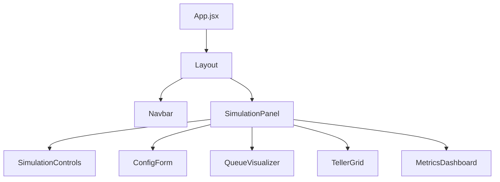

## Overview

The frontend is built with **React 19** and **Vite 7**, organized into feature-based modules that mirror the backend bounded contexts. Located at `frontend/src/`, it provides real-time visualization of simulation state.

## Directory Structure

```
frontend/src/
├── simulation/
│   ├── components/
│   │   ├── SimulationPanel.jsx
│   │   ├── SimulationControls.jsx
│   │   ├── ConfigForm.jsx
│   │   └── StatusIndicator.jsx
│   ├── hooks/
│   └── services/
├── queue/
│   └── components/
│       ├── QueueVisualizer.jsx
│       ├── QueueNode.jsx
│       └── PriorityLegend.jsx
├── teller/
│   └── components/
│       ├── TellerGrid.jsx
│       ├── TellerCard.jsx
│       └── TellerRow.jsx
├── metrics/
│   └── components/
│       ├── MetricsDashboard.jsx
│       ├── WaitTimeChart.jsx
│       ├── ThroughputChart.jsx
│       ├── QueueLengthChart.jsx
│       └── SaturationReport.jsx
├── shared/
│   └── components/
│       ├── Layout.jsx
│       ├── Navbar.jsx
│       ├── Card.jsx
│       ├── Button.jsx
│       ├── Slider.jsx
│       └── Badge.jsx
├── App.jsx
└── main.jsx
```

## Component Architecture



## Simulation Components

### SimulationPanel

Container component that orchestrates the simulation view:

```jsx
import { useState, useEffect } from 'react';
import SimulationControls from './SimulationControls';
import ConfigForm from './ConfigForm';
import QueueVisualizer from '../queue/components/QueueVisualizer';
import TellerGrid from '../teller/components/TellerGrid';
import MetricsDashboard from '../metrics/components/MetricsDashboard';

function SimulationPanel() {
  const [simState, setSimState] = useState(null);
  const [config, setConfig] = useState({
    num_tellers: 3,
    arrival_rate: 1.0,
    service_mean: 5.0
  });
  
  // Poll simulation state
  useEffect(() => {
    const interval = setInterval(async () => {
      const response = await fetch('/api/simulation/state');
      const data = await response.json();
      setSimState(data);
    }, 1000);
    
    return () => clearInterval(interval);
  }, []);
  
  return (
    <div className="simulation-panel">
      <SimulationControls config={config} />
      <ConfigForm config={config} onConfigChange={setConfig} />
      {simState && (
        <>
          <QueueVisualizer customers={simState.waiting_queue} />
          <TellerGrid tellers={simState.tellers} />
          <MetricsDashboard simId={simState.simulation_id} />
        </>
      )}
    </div>
  );
}

export default SimulationPanel;
```

### SimulationControls

Control buttons for simulation lifecycle:

```jsx
function SimulationControls({ config }) {
  const [status, setStatus] = useState('IDLE');
  
  const handleStart = async () => {
    const response = await fetch('/api/simulation/start', {
      method: 'POST',
      headers: { 'Content-Type': 'application/json' },
      body: JSON.stringify(config)
    });
    const data = await response.json();
    setStatus('RUNNING');
  };
  
  const handlePause = async () => {
    await fetch('/api/simulation/pause', { method: 'POST' });
    setStatus('PAUSED');
  };
  
  const handleStop = async () => {
    await fetch('/api/simulation/stop', { method: 'POST' });
    setStatus('FINISHED');
  };
  
  return (
    <div className="controls">
      <button onClick={handleStart} disabled={status === 'RUNNING'}>
        Start
      </button>
      <button onClick={handlePause} disabled={status !== 'RUNNING'}>
        Pause
      </button>
      <button onClick={handleStop}>
        Stop
      </button>
      <StatusIndicator status={status} />
    </div>
  );
}
```

### ConfigForm

Form for simulation parameters:

```jsx
import Slider from '../../shared/components/Slider';

function ConfigForm({ config, onConfigChange }) {
  const handleChange = (field, value) => {
    onConfigChange({ ...config, [field]: value });
  };
  
  return (
    <form className="config-form">
      <div className="form-group">
        <label>Number of Tellers</label>
        <Slider
          value={config.num_tellers}
          min={1}
          max={10}
          onChange={(v) => handleChange('num_tellers', v)}
        />
        <span>{config.num_tellers}</span>
      </div>
      
      <div className="form-group">
        <label>Arrival Rate (λ)</label>
        <Slider
          value={config.arrival_rate}
          min={0.1}
          max={5.0}
          step={0.1}
          onChange={(v) => handleChange('arrival_rate', v)}
        />
        <span>{config.arrival_rate.toFixed(1)} customers/min</span>
      </div>
      
      <div className="form-group">
        <label>Service Time (μ)</label>
        <Slider
          value={config.service_mean}
          min={1.0}
          max={15.0}
          step={0.5}
          onChange={(v) => handleChange('service_mean', v)}
        />
        <span>{config.service_mean.toFixed(1)} min</span>
      </div>
    </form>
  );
}
```

## Queue Components

### QueueVisualizer

Displays customers waiting in queue:

```jsx
import QueueNode from './QueueNode';
import PriorityLegend from './PriorityLegend';

function QueueVisualizer({ customers }) {
  return (
    <div className="queue-visualizer">
      <h3>Waiting Queue ({customers.length})</h3>
      <PriorityLegend />
      <div className="queue-line">
        {customers.map((customer, index) => (
          <QueueNode 
            key={customer.id}
            customer={customer}
            position={index + 1}
          />
        ))}
      </div>
    </div>
  );
}
```

### QueueNode

Single customer in queue:

```jsx
function QueueNode({ customer, position }) {
  const getPriorityColor = (priority) => {
    switch(priority) {
      case 1: return 'bg-red-500';    // High
      case 2: return 'bg-yellow-500'; // Medium
      case 3: return 'bg-green-500';  // Low
      default: return 'bg-gray-500';
    }
  };
  
  const waitTime = Date.now() - customer.arrival_time;
  
  return (
    <div className={`queue-node ${getPriorityColor(customer.priority)}`}>
      <div className="customer-id">{customer.id}</div>
      <div className="position">#{position}</div>
      <div className="wait-time">{(waitTime / 1000).toFixed(1)}s</div>
      <div className="transaction">{customer.transaction_type}</div>
    </div>
  );
}
```

## Teller Components

### TellerGrid

Grid layout of all tellers:

```jsx
import TellerCard from './TellerCard';

function TellerGrid({ tellers }) {
  return (
    <div className="teller-grid">
      <h3>Tellers</h3>
      <div className="grid grid-cols-3 gap-4">
        {Object.entries(tellers).map(([id, teller]) => (
          <TellerCard key={id} teller={teller} />
        ))}
      </div>
    </div>
  );
}
```

### TellerCard

Single teller window:

```jsx
import Badge from '../../shared/components/Badge';

function TellerCard({ teller }) {
  const getStatusColor = (status) => {
    switch(status) {
      case 'IDLE': return 'bg-green-500';
      case 'BUSY': return 'bg-blue-500';
      case 'BROKEN': return 'bg-red-500';
      default: return 'bg-gray-500';
    }
  };
  
  return (
    <div className="teller-card border rounded p-4">
      <div className="flex justify-between items-center mb-2">
        <h4 className="font-semibold">{teller.id}</h4>
        <Badge color={getStatusColor(teller.status)}>
          {teller.status}
        </Badge>
      </div>
      
      {teller.current_customer && (
        <div className="customer-info bg-gray-100 p-2 rounded">
          <p className="text-sm">Serving: {teller.current_customer.id}</p>
          <p className="text-xs text-gray-600">
            {teller.current_customer.transaction_type}
          </p>
        </div>
      )}
      
      <div className="mt-2 text-sm text-gray-600">
        Served: {teller.sessions_served}
      </div>
    </div>
  );
}
```

## Metrics Components

### MetricsDashboard

Container for all metrics visualizations:

```jsx
import { useState, useEffect } from 'react';
import WaitTimeChart from './WaitTimeChart';
import ThroughputChart from './ThroughputChart';
import QueueLengthChart from './QueueLengthChart';
import SaturationReport from './SaturationReport';

function MetricsDashboard({ simId }) {
  const [metrics, setMetrics] = useState(null);
  
  useEffect(() => {
    const interval = setInterval(async () => {
      const response = await fetch('/api/metrics/report');
      const data = await response.json();
      setMetrics(data);
    }, 2000);
    
    return () => clearInterval(interval);
  }, [simId]);
  
  if (!metrics) return <div>Loading metrics...</div>;
  
  return (
    <div className="metrics-dashboard">
      <h3>Performance Metrics</h3>
      <div className="grid grid-cols-2 gap-4">
        <WaitTimeChart data={metrics.wait_time_history} />
        <ThroughputChart data={metrics.throughput_history} />
        <QueueLengthChart data={metrics.queue_length_history} />
        <SaturationReport metrics={metrics} />
      </div>
    </div>
  );
}
```

## Shared Components

### Card

```jsx
function Card({ title, children, className }) {
  return (
    <div className={`card bg-white rounded-lg shadow p-4 ${className || ''}`}>
      {title && <h4 className="font-semibold mb-2">{title}</h4>}
      <div className="card-body">{children}</div>
    </div>
  );
}
```

### Button

```jsx
function Button({ children, onClick, variant = 'primary', disabled }) {
  const baseClass = 'px-4 py-2 rounded font-medium transition-colors';
  const variants = {
    primary: 'bg-blue-500 hover:bg-blue-600 text-white',
    secondary: 'bg-gray-200 hover:bg-gray-300 text-gray-800',
    danger: 'bg-red-500 hover:bg-red-600 text-white'
  };
  
  return (
    <button
      onClick={onClick}
      disabled={disabled}
      className={`${baseClass} ${variants[variant]} ${disabled ? 'opacity-50 cursor-not-allowed' : ''}`}
    >
      {children}
    </button>
  );
}
```

### Slider

```jsx
function Slider({ value, min, max, step = 1, onChange }) {
  return (
    <input
      type="range"
      value={value}
      min={min}
      max={max}
      step={step}
      onChange={(e) => onChange(parseFloat(e.target.value))}
      className="slider"
    />
  );
}
```

## Component Props Patterns

### Prop Types (Implicit)

```jsx
// Simulation state
interface SimState {
  simulation_id: string;
  status: 'IDLE' | 'RUNNING' | 'PAUSED' | 'FINISHED';
  clock: number;
  waiting_queue: Customer[];
  tellers: Record<string, Teller>;
}

// Customer
interface Customer {
  id: string;
  priority: 1 | 2 | 3;
  arrival_time: number;
  transaction_type: string;
}

// Teller
interface Teller {
  id: string;
  status: 'IDLE' | 'BUSY' | 'BROKEN';
  current_customer: Customer | null;
  sessions_served: number;
}
```

## Next Steps

<CardGroup cols={2}>
  <Card title="State Management" icon="database" href="/architecture/frontend/state-management">
    How state flows through the application
  </Card>
  <Card title="Visualization" icon="chart-line" href="/architecture/frontend/visualization">
    Chart libraries and real-time updates
  </Card>
  <Card title="API Integration" icon="plug" href="/api/overview">
    How frontend communicates with backend
  </Card>
  <Card title="Queue Visualization" icon="bars-staggered" href="/features/queue-visualization">
    Features of the queue display
  </Card>
</CardGroup>
