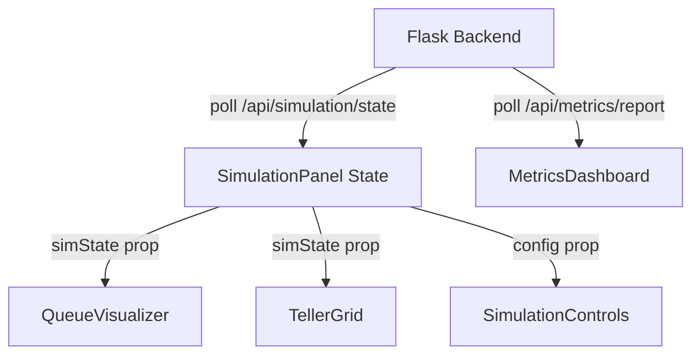

## Overview

SimulationBank uses **React hooks** for state management, with no external state libraries. State is managed locally in components and synchronized with the backend via HTTP polling.

## State Architecture



## Root State (SimulationPanel)

The `SimulationPanel` component holds the primary state:

```jsx
import { useState, useEffect } from 'react';

function SimulationPanel() {
  // Simulation configuration
  const [config, setConfig] = useState({
    num_tellers: 3,
    arrival_config: {
      arrival_rate: 1.0,
      arrival_dist: 'exponential',
      priority_weights: [0.1, 0.3, 0.6]
    },
    service_config: {
      service_mean: 5.0,
      service_dist: 'exponential',
      service_stddev: 1.0
    },
    max_simulation_time: 28800,
    max_queue_capacity: 100
  });
  
  // Current simulation state
  const [simState, setSimState] = useState(null);
  
  // Loading and error states
  const [loading, setLoading] = useState(false);
  const [error, setError] = useState(null);
  
  // Polling simulation state
  useEffect(() => {
    if (!simState || simState.status !== 'RUNNING') return;
    
    const interval = setInterval(async () => {
      try {
        const response = await fetch('http://localhost:5000/api/simulation/state');
        if (!response.ok) throw new Error('Failed to fetch state');
        const data = await response.json();
        setSimState(data);
      } catch (err) {
        setError(err.message);
      }
    }, 1000); // Poll every 1 second
    
    return () => clearInterval(interval);
  }, [simState?.status]);
  
  // ... render
}
```

## State Flow Patterns

### Lifting State Up

Configuration state is lifted to `SimulationPanel` and passed down:

```jsx
function SimulationPanel() {
  const [config, setConfig] = useState(defaultConfig);
  
  return (
    <>
      <ConfigForm config={config} onConfigChange={setConfig} />
      <SimulationControls config={config} onStart={handleStart} />
    </>
  );
}

function ConfigForm({ config, onConfigChange }) {
  const handleChange = (field, value) => {
    onConfigChange({ ...config, [field]: value });
  };
  
  // ... render
}
```

### Derived State

Some state is computed from simState:

```jsx
function SimulationPanel() {
  const [simState, setSimState] = useState(null);
  
  // Derived: queue length
  const queueLength = simState?.waiting_queue?.length || 0;
  
  // Derived: number of busy tellers
  const busyTellers = simState?.tellers
    ? Object.values(simState.tellers).filter(t => t.status === 'BUSY').length
    : 0;
  
  // Derived: system utilization
  const utilization = simState?.tellers
    ? busyTellers / Object.keys(simState.tellers).length
    : 0;
  
  return (
    <>
      <div>Queue: {queueLength} customers</div>
      <div>Utilization: {(utilization * 100).toFixed(1)}%</div>
    </>
  );
}
```

## API Communication

### Starting a Simulation

```jsx
const handleStart = async () => {
  setLoading(true);
  setError(null);
  
  try {
    const response = await fetch('http://localhost:5000/api/simulation/start', {
      method: 'POST',
      headers: {
        'Content-Type': 'application/json'
      },
      body: JSON.stringify(config)
    });
    
    if (!response.ok) {
      throw new Error(`HTTP error! status: ${response.status}`);
    }
    
    const data = await response.json();
    setSimState(data);
  } catch (err) {
    setError(err.message);
  } finally {
    setLoading(false);
  }
};
```

### Pausing/Stopping

```jsx
const handlePause = async () => {
  try {
    await fetch('http://localhost:5000/api/simulation/pause', {
      method: 'POST'
    });
    // Update local state optimistically
    setSimState(prev => ({ ...prev, status: 'PAUSED' }));
  } catch (err) {
    setError(err.message);
  }
};

const handleStop = async () => {
  try {
    await fetch('http://localhost:5000/api/simulation/stop', {
      method: 'POST'
    });
    setSimState(prev => ({ ...prev, status: 'FINISHED' }));
  } catch (err) {
    setError(err.message);
  }
};
```

## Polling Strategy

### Simulation State Polling

```jsx
useEffect(() => {
  // Only poll when simulation is running
  if (simState?.status !== 'RUNNING') return;
  
  const interval = setInterval(async () => {
    const response = await fetch('/api/simulation/state');
    const data = await response.json();
    setSimState(data);
  }, 1000); // 1 second interval
  
  return () => clearInterval(interval);
}, [simState?.status]);
```

### Metrics Polling

```jsx
useEffect(() => {
  const interval = setInterval(async () => {
    const response = await fetch('/api/metrics/report');
    const data = await response.json();
    setMetrics(data);
  }, 2000); // 2 second interval (less frequent)
  
  return () => clearInterval(interval);
}, []);
```

<Note>
Polling intervals are different: simulation state updates every 1s, metrics every 2s to reduce load.
</Note>

## Custom Hooks

### useSimulation

Encapsulates simulation state logic:

```jsx
function useSimulation() {
  const [simState, setSimState] = useState(null);
  const [loading, setLoading] = useState(false);
  const [error, setError] = useState(null);
  
  const startSimulation = async (config) => {
    setLoading(true);
    try {
      const response = await fetch('/api/simulation/start', {
        method: 'POST',
        headers: { 'Content-Type': 'application/json' },
        body: JSON.stringify(config)
      });
      const data = await response.json();
      setSimState(data);
    } catch (err) {
      setError(err.message);
    } finally {
      setLoading(false);
    }
  };
  
  const pauseSimulation = async () => {
    await fetch('/api/simulation/pause', { method: 'POST' });
    setSimState(prev => ({ ...prev, status: 'PAUSED' }));
  };
  
  const stopSimulation = async () => {
    await fetch('/api/simulation/stop', { method: 'POST' });
    setSimState(prev => ({ ...prev, status: 'FINISHED' }));
  };
  
  useEffect(() => {
    if (simState?.status !== 'RUNNING') return;
    
    const interval = setInterval(async () => {
      const response = await fetch('/api/simulation/state');
      const data = await response.json();
      setSimState(data);
    }, 1000);
    
    return () => clearInterval(interval);
  }, [simState?.status]);
  
  return {
    simState,
    loading,
    error,
    startSimulation,
    pauseSimulation,
    stopSimulation
  };
}
```

**Usage**:

```jsx
function SimulationPanel() {
  const {
    simState,
    loading,
    error,
    startSimulation,
    pauseSimulation,
    stopSimulation
  } = useSimulation();
  
  // ... render
}
```

### useMetrics

```jsx
function useMetrics(simId) {
  const [metrics, setMetrics] = useState(null);
  
  useEffect(() => {
    if (!simId) return;
    
    const interval = setInterval(async () => {
      const response = await fetch('/api/metrics/report');
      const data = await response.json();
      setMetrics(data);
    }, 2000);
    
    return () => clearInterval(interval);
  }, [simId]);
  
  return metrics;
}
```

## Error Handling

### Error State Pattern

```jsx
function SimulationPanel() {
  const [error, setError] = useState(null);
  
  const fetchData = async () => {
    setError(null);
    try {
      const response = await fetch('/api/simulation/state');
      if (!response.ok) {
        throw new Error(`HTTP ${response.status}: ${response.statusText}`);
      }
      const data = await response.json();
      setSimState(data);
    } catch (err) {
      setError(err.message);
    }
  };
  
  return (
    <>
      {error && (
        <div className="error-banner bg-red-100 text-red-800 p-4 rounded">
          Error: {error}
        </div>
      )}
      {/* ... rest of UI */}
    </>
  );
}
```

## Loading States

```jsx
function SimulationPanel() {
  const [loading, setLoading] = useState(false);
  
  if (loading) {
    return (
      <div className="flex items-center justify-center h-64">
        <div className="spinner">Loading...</div>
      </div>
    );
  }
  
  // ... normal render
}
```

## Optimistic Updates

Update UI immediately, sync with backend later:

```jsx
const handlePause = async () => {
  // Optimistic update
  setSimState(prev => ({ ...prev, status: 'PAUSED' }));
  
  try {
    await fetch('/api/simulation/pause', { method: 'POST' });
  } catch (err) {
    // Revert on error
    setSimState(prev => ({ ...prev, status: 'RUNNING' }));
    setError('Failed to pause simulation');
  }
};
```

## State Persistence

### LocalStorage for Config

```jsx
function usePersistedConfig() {
  const [config, setConfig] = useState(() => {
    const saved = localStorage.getItem('sim_config');
    return saved ? JSON.parse(saved) : defaultConfig;
  });
  
  useEffect(() => {
    localStorage.setItem('sim_config', JSON.stringify(config));
  }, [config]);
  
  return [config, setConfig];
}
```

## Performance Optimization

### Memoization

```jsx
import { useMemo } from 'react';

function MetricsDisplay({ metrics }) {
  const avgWaitTime = useMemo(() => {
    if (!metrics?.wait_times) return 0;
    const sum = metrics.wait_times.reduce((acc, wt) => acc + wt.wait_time, 0);
    return sum / metrics.wait_times.length;
  }, [metrics?.wait_times]);
  
  return <div>Avg Wait: {avgWaitTime.toFixed(2)}s</div>;
}
```

### Callback Memoization

```jsx
import { useCallback } from 'react';

function ConfigForm({ onConfigChange }) {
  const handleArrivalRateChange = useCallback((value) => {
    onConfigChange(prev => ({
      ...prev,
      arrival_config: { ...prev.arrival_config, arrival_rate: value }
    }));
  }, [onConfigChange]);
  
  return <Slider onChange={handleArrivalRateChange} />;
}
```

## State Debugging

### React DevTools

View component state in browser:

```jsx
function SimulationPanel() {
  const [simState, setSimState] = useState(null);
  
  // Expose state to window for debugging
  useEffect(() => {
    window.DEBUG_simState = simState;
  }, [simState]);
  
  // ...
}
```

Access in console: `window.DEBUG_simState`

### State Logging

```jsx
useEffect(() => {
  console.log('SimState updated:', simState);
}, [simState]);
```

## Next Steps

<CardGroup cols={2}>
  <Card title="Component Structure" icon="sitemap" href="/architecture/frontend/components">
    Learn about component organization
  </Card>
  <Card title="Visualization" icon="chart-line" href="/architecture/frontend/visualization">
    How charts are rendered and updated
  </Card>
  <Card title="API Integration" icon="plug" href="/api/overview">
    Complete API reference
  </Card>
  <Card title="Running Simulations" icon="play" href="/guides/running-simulations">
    User guide for the simulation interface
  </Card>
</CardGroup>
