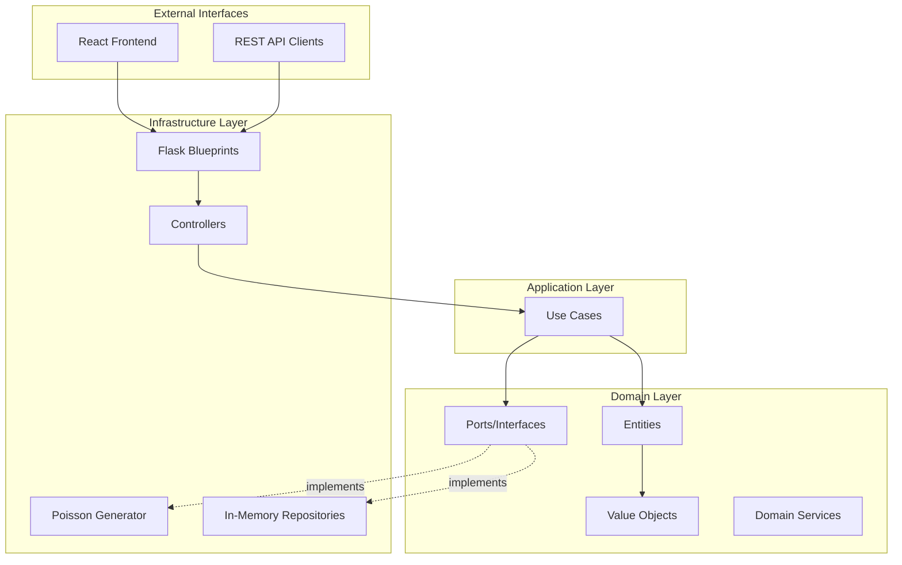

## Architectural Pattern

SimulationBank follows **Hexagonal Architecture** (also known as Ports and Adapters) combined with **Domain-Driven Design** (DDD) principles. This architecture ensures:

- Clean separation of concerns
- Testability and maintainability
- Technology independence at the core
- Clear dependency flow from outside-in

## System Architecture



## Layer Responsibilities

### Domain Layer (Core)

The innermost layer contains:

- **Entities**: `Customer`, `Teller`, `DiscreteEventSimulation`
- **Value Objects**: `SimulationConfig`, `Priority`, `TransactionType`
- **Domain Events**: `SimulationEvent` with event types
- **Ports**: Interfaces like `CustomerGenerator`, `MetricsRepository`

<Note>
The domain layer has **zero dependencies** on external frameworks. It contains pure business logic.
</Note>

### Application Layer

Orchestrates domain logic through use cases:

- `run_simulation.py` - Execute simulation
- `generate_customer.py` - Create customer instances
- `record_customer_served.py` - Track metrics
- `get_simulation_report.py` - Generate reports

### Infrastructure Layer

Provides concrete implementations:

- **HTTP Adapters**: Flask blueprints and controllers
- **Generators**: `ConfigurableGenerator` (Poisson distribution)
- **Persistence**: `InMemoryMetricsRepository`
- **Frontend**: React components and state management

## Bounded Contexts

The system is organized into bounded contexts:

<CardGroup cols={2}>
  <Card title="Simulation" icon="gears">
    Core simulation engine, event processing, and lifecycle management
  </Card>
  <Card title="Customer" icon="user">
    Customer generation, attributes, and state transitions
  </Card>
  <Card title="Teller" icon="building-columns">
    Teller resources, service operations, and utilization
  </Card>
  <Card title="Queue" icon="bars-staggered">
    Priority queue implementation and ordering logic
  </Card>
  <Card title="Metrics" icon="chart-line">
    Metrics collection, aggregation, and reporting
  </Card>
  <Card title="Shared" icon="handshake">
    Shared kernel with common utilities and types
  </Card>
</CardGroup>

## Dependency Rule

Dependencies flow **inward only**:

```
Infrastructure → Application → Domain
```

- Domain layer depends on nothing
- Application layer depends only on domain
- Infrastructure layer depends on both application and domain

<Warning>
Never let the domain layer depend on infrastructure concerns like Flask, databases, or external APIs.
</Warning>

## Technology Stack

### Backend

- **Language**: Python 3.x
- **Web Framework**: Flask
- **CORS**: flask-cors
- **Event Queue**: Python heapq (min-heap)
- **Random Generation**: NumPy (exponential distribution)

### Frontend

- **Language**: JavaScript (ES6+)
- **Framework**: React 19.x
- **Build Tool**: Vite 7.x
- **State Management**: React hooks (useState, useEffect)
- **HTTP Client**: Fetch API

## Directory Structure

```
SimulationBank/
├── backend/
│   ├── main.py
│   ├── requirements.txt
│   └── src/
│       ├── simulation/
│       │   ├── domain/
│       │   ├── application/
│       │   └── infrastructure/
│       ├── customer/
│       ├── teller/
│       ├── queue/
│       ├── metrics/
│       └── shared/
└── frontend/
    ├── package.json
    ├── index.html
    └── src/
        ├── simulation/
        ├── customer/
        ├── teller/
        ├── queue/
        ├── metrics/
        └── shared/
```

## Design Principles

### Separation of Concerns

Each module has a single, well-defined responsibility:

- Simulation manages time and event processing
- Customer handles arrival and service logic
- Teller manages resource allocation
- Queue implements priority ordering
- Metrics tracks performance indicators

### Dependency Inversion

The domain defines interfaces (ports), and infrastructure provides implementations (adapters):

```python
# Domain defines the interface
class CustomerGenerator(ABC):
    @abstractmethod
    def get_next_arrival_interval(self) -> float:
        pass

# Infrastructure implements it
class ConfigurableGenerator(CustomerGenerator):
    def get_next_arrival_interval(self) -> float:
        return np.random.exponential(1.0 / self.arrival_rate)
```

### Immutability

Value objects are immutable:

```python
@dataclass(frozen=True)
class SimulationConfig:
    num_tellers: int = 3
    arrival_config: Dict[str, Any] = field(default_factory=dict)
    service_config: Dict[str, Any] = field(default_factory=dict)
```

## Communication Patterns

### Frontend ↔ Backend

- **Protocol**: HTTP/REST
- **Format**: JSON
- **CORS**: Enabled for local development

### Event Flow

1. Frontend sends configuration via POST `/api/simulation/start`
2. Backend creates `DiscreteEventSimulation` instance
3. Simulation processes events in chronological order
4. Frontend polls GET `/api/simulation/state` for updates
5. Metrics accumulate in `MetricsRepository`
6. Frontend fetches GET `/api/metrics/report` for analysis

## Next Steps

<CardGroup cols={2}>
  <Card title="Domain Model" icon="diagram-project" href="/architecture/domain-model">
    Explore entities, value objects, and domain events
  </Card>
  <Card title="Simulation Engine" icon="gears" href="/architecture/backend/simulation-engine">
    Deep dive into the discrete event simulation implementation
  </Card>
  <Card title="Frontend Architecture" icon="window" href="/architecture/frontend/components">
    Learn about React components and visualization
  </Card>
  <Card title="API Design" icon="code" href="/api/overview">
    Understand the REST API structure
  </Card>
</CardGroup>
